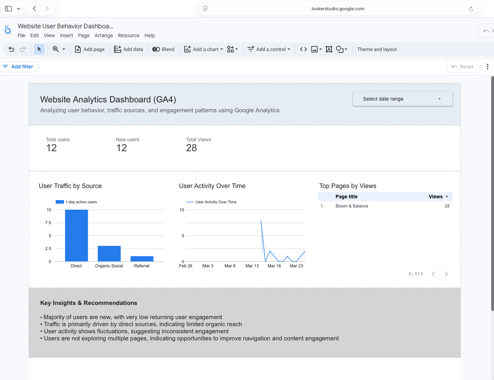

# Website User Behavior Analysis using Google Analytics and Looker Studio

## Project Overview

This project focuses on analyzing user behavior on a live fitness website. I integrated Google Analytics (GA4) to track real user activity and used Looker Studio to build an interactive dashboard.

The objective was to understand how users visit the website, how they interact with the content, and identify areas where engagement and retention can be improved.

## Tools Used

* Google Analytics (GA4)
* Google Looker Studio

## Analysis Performed

* Measured total users and new users
* Analyzed traffic sources such as direct, organic, and social
* Evaluated page performance based on views
* Studied user activity trends over time
* Observed user engagement and retention patterns

## Key Insights

* Most users are first-time visitors, indicating low retention
* A large portion of traffic comes from direct sources, suggesting limited organic reach
* User activity is inconsistent, with spikes followed by drops
* Users are not exploring multiple pages, indicating opportunities to improve navigation and content engagement

## Recommendations

* Improve homepage structure and call-to-action to guide users effectively
* Add engaging content such as workout previews or visuals
* Increase visibility through SEO and social media channels
* Enhance user experience to encourage repeat visits

## Dashboard

[https://lookerstudio.google.com/reporting/622991c7-b925-4d94-869f-d0e1c956e071 
](url)

## Dashboard Preview

## Website
[
https://bloomandbalance.netlify.app](url)

## Data Source

The data used in this project is collected from real user interactions through Google Analytics.
Sample exported datasets are included in this repository for reference.

## Conclusion

This project demonstrates how real user data can be analyzed to understand behavior patterns and generate actionable insights to improve website performance and user engagement.
